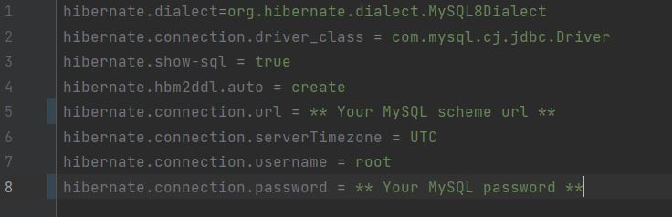
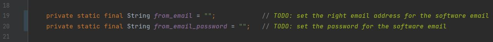
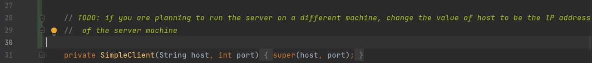

## "Lilac" Software For Managing Plants Chain Store

# Students Team Data:

Kareem Jabareen     -   https://www.linkedin.com/in/kareem-mokhtar-jabareen/

Mostafa Egbaria     -   https://www.linkedin.com/in/mostafa-egbaria-2a952b208/

Sameer Najjar       -   https://www.linkedin.com/in/sameer-najjar-8976b71b5/

# Project Description:

The project aims to develop a software for managing a chain store for selling plants. The software has different types of users: Main Admin, Shop Admin, different workers and different types of clients. Each one of the users has his own role in managing the chain store.

The software uses TCP/IP protoccol to connect clients to the user and is supposed to run clients on the same LAN as the server side. We let many clients connect at the same time to the server without any problem.

For more information about the project please check the description PDF file.

# How to Run:

1. Download the source code from the reporistory.

2. Create a new Scheme in MySQL on the same machine to run the server.

3. Open the file `hibernate.properties` in the server model, and set the right values for your MySQL Scheme.

4. Open the `SendMail` class in the server model, and set the right values for the E-mail address and password according to the E-mail you specified for sending conformation E-mails.

Note: Your E-mail provider might block this app from accessing and managing messages, you might consider change your E-mail settings using the browser.

5. If you are planning for running both client and server on the same machine, then skip this step. Otherwise, open the file `SimpleClient` in the client model, and set the IP for the machine running the server side.

6. Use Maven for creating the .jar files for both server and client.

7. Run the server executable file, then run the client executable one.

8. For displaying the images in the calatogue, make sure you place the `Images` directory in the same directory of the jar files in each side of the server side and the client one.
